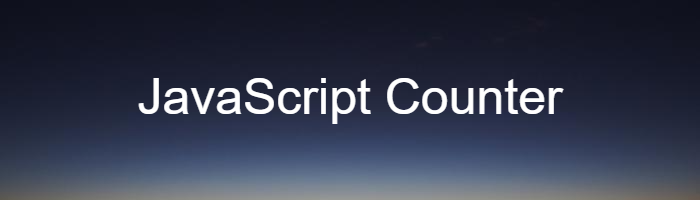

. 
This is one of my first JavaScript project. 
It is a simple counter that gave me the chance to learn and use some of the basic tools of JavaScript.

## Lenguages used
- HTML
- CSS
- JavaScript

## How can you use it?
###### Simply click the link below and try it!
[Click Me To Try The Counter](https://alessandro-caiazzo.github.io/counter-javaScript/). 
It has been uploaded by using GitHub Pages.

